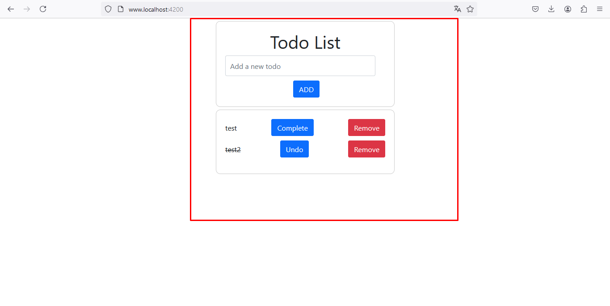

# TodoList usando Angular

## Descrição

Este projeto é uma aplicação de lista de tarefas (TodoList) desenvolvida utilizando Angular. O objetivo é fornecer uma interface simples e intuitiva para a gestão de tarefas diárias, permitindo adicionar e remover itens da lista.

## Funcionalidades

- Adicionar novas tarefas
- Marcar tarefas como concluídas
- Remover tarefas da lista

## Tecnologias Utilizadas

- [Angular](https://angular.io/) - Framework front-end
- [TypeScript](https://www.typescriptlang.org/) - Superset de JavaScript
- [Boostrap](https://getbootstrap.com/) - Boostrap

### O que é um "TodoList"?

Um "TodoList" é uma aplicação simples que permite aos usuários criar uma lista de tarefas a serem realizadas. Cada tarefa pode ser adicionada à lista, marcada como concluída, editada ou removida. Esse tipo de aplicação é muito comum e serve como um excelente exercício prático para iniciantes em desenvolvimento de software.

### Importância de criar um "TodoList" ao aprender um novo framework de front-end

1. **Conceitos Básicos**: Um "TodoList" cobre muitos conceitos fundamentais de um framework de front-end, como a criação e manipulação de componentes, gerenciamento de estado e manipulação de eventos.

2. **Interatividade**: Ao trabalhar com a adição, edição e remoção de tarefas, dar para aprender a gerenciar a interatividade de uma aplicação, uma habilidade essencial para desenvolvedores front-end.

3. **Boas Práticas**: Implementar um "TodoList" permite que se pratique e aprenda boas práticas de código, como a separação de responsabilidades (serviços, componentes) e a organização do projeto.

4. **Reutilização de Componentes**: Pode-se criar componentes reutilizáveis, uma prática importante ao trabalhar com frameworks modernos como Angular.

5. **Feedback Imediato**: Ver as mudanças em tempo real enquanto desenvolve é motivador e ajuda a entender melhor como o framework funciona.

6. **Base para Projetos Maiores**: Compreender e implementar um "TodoList" fornece uma base sólida para projetos mais complexos. Muitos conceitos podem ser escalados para aplicações maiores.

## Development server

Run `ng serve` for a dev server. Navigate to `http://localhost:4200/`. The application will automatically reload if you change any of the source files.

## Code scaffolding

Run `ng generate component component-name` to generate a new component. You can also use `ng generate directive|pipe|service|class|guard|interface|enum|module`.

## Build

Run `ng build` to build the project. The build artifacts will be stored in the `dist/` directory.

## Running unit tests

Run `ng test` to execute the unit tests via [Karma](https://karma-runner.github.io).

## Running end-to-end tests

Run `ng e2e` to execute the end-to-end tests via a platform of your choice. To use this command, you need to first add a package that implements end-to-end testing capabilities.

## Further help

To get more help on the Angular CLI use `ng help` or go check out the [Angular CLI Overview and Command Reference](https://angular.dev/tools/cli) page.
